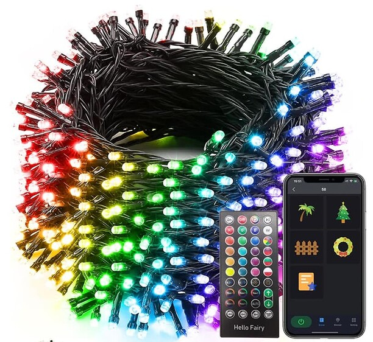

# Hello Fairy Bluetooth Lights Integration for Home Assistant



This custom integration allows you to control Hello Fairy Bluetooth LED string lights from Home Assistant. The integration supports full RGB color control, brightness adjustment, and all built-in animated effects.

## Features

- **ConfigFlow**: Automatically detect Hello Fairy bluetooth string lights.
- **Full RGB Color Control**: Set any color using RGB values
- **Brightness Control**: Adjust brightness from 0-100%
- **Effect Support**: Listed 14 of my favorites of the ~58 effects options
- **Remote Status**: Automatically syncs with device state changes from remote control. Hopefully.

## Supported Devices

This integration works with Hello Fairy Bluetooth LED string lights that advertise with the name pattern `Hello Fairy-*`.  These used to be sold directly under the "Hello Fairy" brand; now I seem to find them under different names such as "Minetom". I'm not sure if the bluetooth identifier has changed as well, but hopefully these will be autodetected as well. If your Bluetooth string lights are controlled via the Hello Fairy app, they will likely work with this integration.

## Requirements

These lights are controlled via Bluetooth Low Energy. Your Home Assistance instance needs a way to send Bluetooth signals. See the [Bluetooth integration](https://www.home-assistant.io/integrations/bluetooth/).

## Installation

Until this integration is included in HACS, you must manually install:

1. Copy the `custom_components/hello_fairy_ble` folder to your Home Assistant `config/custom_components/` directory
2. Restart Home Assistant
3. Go to Settings > Devices & Services > Add Integration
4. Search for "Hello Fairy" and select it
5. Your Hello Fairy lights should be automatically discovered via Bluetooth

## Configuration

The integration uses [Bluetooth discovery](https://www.home-assistant.io/integrations/bluetooth/) to automatically find Hello Fairy devices. No manual configuration is required if your device is within Bluetooth range.

## Usage

Once configured, your Hello Fairy lights will appear as a light entity in Home Assistant with the following capabilities:

- **On/Off Control**: Turn lights on and off
- **RGB Color**: Set custom colors using the color picker
- **Brightness**: Adjust brightness with the brightness slider
- **Effects**: Choose from 14 built-in effects in the effect dropdown
- **Preset**: There is also a separate numerical control to select any of the full range of effects by number

### Available Effects

The integration includes the following preset effects in the light effects dropdown. You can also use the separate 'preset' control to select any of the other presets.

- Blue White Dissolve
- Blue Sparkle  
- White Sparkle
- Blue with Pink Sparkle
- Fireworks
- Xmas
- Candy Cane
- Halloween
- Red Gold
- July 4th
- Valentine
- St. Patrick
- May Day
- Snow Day

***

# Technical Implementation

This integration implements the Hello Fairy protocol I initially worked out for an [ESPHome project](https://community.home-assistant.io/t/control-hello-fairy-ble-string-lights-with-esphome/818595). My conclusion there is that really I should have written a Home Assistant *Integration* rather than custom ESP32 yaml; not only is all the send/ack/notify stuff already mostly handled in the HA libraries, but also you get to use any/all of your Bluetooth proxies (e.g. ESP32's configured with esphome.bluetooth-proxy) automatically, instead of hard-coding a specific MAC into a specific ESP.

So, a year later, here is that integration (my first).

### Protocol Details

- **Service UUID**: `49535343-fe7d-4ae5-8fa9-9fafd205e455`
- **Command UUID**: `49535343-8841-43f4-a8d4-ecbe34729bb3`
- **Notify UUID**: `49535343-1E4D-4BD9-BA61-23C647249616`

### Command Format

Commands use the following structure:

- `0xAA` (prefix) + command type + length + data + checksum

### Power Commands

- **On**: `AA 02 01 01 AE`
- **Off**: `AA 02 01 00 AD`

### Color Commands

- **HSV Color**: `AA 03 07 01 HHHH SSSS VVVV CC`
  - H: Hue (0-359 degrees, 2 bytes)
  - S: Saturation (0-1000, 2 bytes) 
  - V: Value/Brightness (0-1000, 2 bytes)
  - CC: Checksum

### Preset Commands  

- **Effect**: `AA 03 04 02 PP VVVV CC`
  - PP: Preset number (1-58)
  - VVVV: Brightness (0-1000, 2 bytes)
  - CC: Checksum

### Status Notifications

The device sends status updates via BLE notifications when state changes from the remote. Maybe also in response to some query command that I haven't discovered yet.

- Power state (byte 6): `00` = off, `01` = on  
- Mode (byte 7): `01` = color mode, `02` = preset mode
- Color data (bytes 8-13): HSV values when in color mode
- Preset data (bytes 8-10): Preset number and brightness when in preset mode

## Troubleshooting

### Device Not Discovered

1. Ensure the Hello Fairy lights are powered on and *not already connected to your phone app*
2. Try power cycling the Hello Fairy lights
3. Check that Bluetooth is enabled on your Home Assistant host or Bluetooth proxies
4. Verify the device name starts with "Hello Fairy-" (in the logs)
5. Try turning on logging and restarting Home Assistant:

```console
logger:
  default: warn
  logs:
    custom_components.hello_fairy_ble: debug
    #   for even more debug info, turn on
    # bleak: debug
    # homeassistant.components.bluetooth: debug
```

### Effect Not Working

1. Make sure the device is turned on before applying effects
2. Some effects may take a moment to activate
3. Try switching between color mode and effect mode

## Contributing

This integration is based on the protocol reverse-engineering work originally from my [`fairy.yaml` ESPHome configuration](https://community.home-assistant.io/t/control-hello-fairy-ble-string-lights-with-esphome). Contributions and improvements are welcome!

## License

This project is provided as-is for personal use. Please respect the original device manufacturer's terms of service.